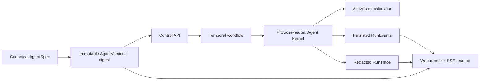

# Universal Agent Studio

> Local-first web-платформа, в которой один AI-агент остаётся понятным
> приложением для пользователя и раскрывается до версий, графа, событий,
> trace, моделей, tools и API для инженера.

[](https://github.com/Strongf-bob/universal-agent-studio/actions/workflows/slice1.yml)
[](https://github.com/Strongf-bob/universal-agent-studio/actions/workflows/contracts.yml)
[](LICENSE)
[](LOCALIZATION.md)

## Уже работает

Slice 1 — это локальный исполняемый spine, а не макет интерфейса:

- immutable `AgentVersion` с каноническим digest;
- видимый Web-путь setup → JSON import → validation → activation;
- local owner, Argon2id, opaque session, CSRF и project scope;
- Web + REST API на одном контракте;
- Temporal workflow, resumable SSE и idempotent run creation;
- deterministic model → allowlisted calculator → structured output;
- persisted redacted trace с attempt/timing/provenance, read-only graph и
  keyboard table;
- `ru-RU` / `en-US`, сохранение текущего run при смене языка;
- opt-in OpenAI-compatible BYOK adapter за явным origin allowlist;
- Docker Compose с отдельными PostgreSQL и Temporal volumes.


Скриншот создан из фактически запущенного локального стека. Golden input
`19 × 23` возвращает `{"value":437}` и сохраняет восемь упорядоченных событий.

## Запуск локально

Нужны Docker Desktop (или Docker Engine + Compose v2), Node.js 26,
pnpm 11.7.0, Python 3.14 и uv 0.11.32.

```bash
uv sync --all-packages --frozen
pnpm install --frozen-lockfile
pnpm dev:local
```

После readiness:

- Studio: <http://localhost:3000/ru-RU/setup>
- Control API: <http://localhost:8000/health/ready>
- Temporal UI: <http://localhost:8080>

Первый воспроизводимый walkthrough, включая setup, импорт/активацию fixture,
run, refresh, locale switch, trace inspection, cancellation и login:

```bash
pnpm --filter @universal-agent-studio/studio-web exec playwright install chromium
pnpm test:e2e
```

Остановка сохраняет локальные данные:

```bash
pnpm local:down
```

Полный reset требует точной явной фразы и ownership marker; он удаляет только
Compose volumes и принадлежащую проекту `.local` state directory:

```bash
pnpm local:reset -- --confirm "RESET LOCAL DATA"
```

Подробности, порты, диагностика и BYOK smoke описаны в
[локальном operator guide](docs/operations/LOCAL_PREVIEW.md).

## Один контракт, несколько представлений



`AgentSpec` — единственный источник истины. Web не хранит вторую модель
графа, runtime не зависит от конкретного LLM provider, а durable execution
скрыт за портом ядра.

## Проверка

```bash
pnpm check
pnpm test:contracts
pnpm test:web
uv run pytest -q
pnpm test:e2e
uv run pytest tests/security tests/integration -q
```

Обязательный GitHub Actions gate собирает контейнеры, мигрирует чистую БД,
поднимает полный stack и выполняет Chromium E2E без внешнего LLM.
BYOK smoke запускается только явно и не входит в обязательный CI.

## Границы текущего preview

Slice 1 доказывает путь `input → model → tool → output → trace`. Editable
canvas, draft authoring, RAG, arbitrary HTTP/code nodes, MCP, public
publishing, multi-user administration, eval campaigns и autoresearch
начинаются в последующих slices.

Порядок развития зафиксирован в [ROADMAP.md](ROADMAP.md), а точный release
gate — в [acceptance-контракте Slice 1](docs/acceptance/SLICE_1_EXECUTABLE_SPINE.md).

## Архитектурные и security-документы

- [PRODUCT.md](PRODUCT.md) — продукт и progressive disclosure.
- [ARCHITECTURE.md](ARCHITECTURE.md) — границы control plane, runtime и kernel.
- [DESIGN.md](DESIGN.md) — UX, визуальный язык и accessibility.
- [docs/CONTRACTS.md](docs/CONTRACTS.md) — JSON Schema и generated types.
- [docs/ARCHITECTURAL_INVARIANTS.md](docs/ARCHITECTURAL_INVARIANTS.md) — неизменяемые правила.
- [docs/adr/](docs/adr/) — принятые архитектурные решения.
- [SECURITY.md](SECURITY.md) и [docs/THREAT_MODEL.md](docs/THREAT_MODEL.md) — policy и attacker stories.
- [EVALS.md](EVALS.md) — будущий eval/autoresearch контур.
- [OPEN_SOURCE_POLICY.md](OPEN_SOURCE_POLICY.md) и [third_party/candidates.yaml](third_party/candidates.yaml) — provenance и лицензии.

## Участие и лицензия

Правила изменений находятся в [CONTRIBUTING.md](CONTRIBUTING.md).
First-party код распространяется по [Apache License 2.0](LICENSE).
Сторонние компоненты имеют собственные лицензии и фиксируются в registry.
