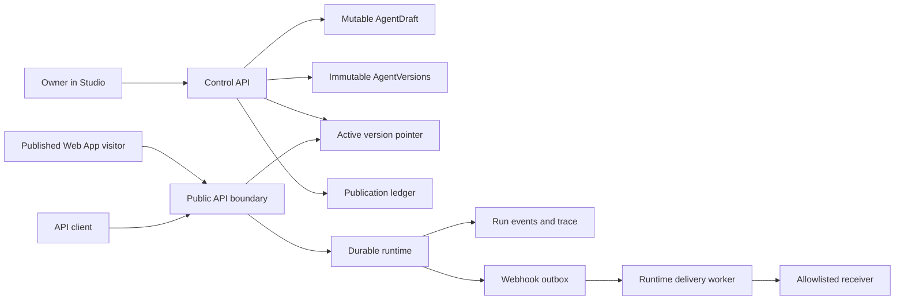

# Slice 3 design: publishing, immutable versions and public delivery

**Status:** Approved for implementation

**Date:** 2026-07-25

## Context

Slices 1 and 2 established a durable runtime, immutable `AgentVersion`
snapshots, a compare-and-swap active-version pointer and one mutable canonical
`AgentDraft`. Slice 3 turns those internal capabilities into a safe publishing
surface without merging Studio privileges into the public product.

The control scenario is deliberately small:

1. publish calculator version v1;
2. use it from a public Web App and API;
3. publish v2;
4. switch traffic back to v1;
5. prove that v1, v2, their runs and the publication history were not changed.

The implementation remains a loopback-only Local Preview. Internet deployment,
TLS termination, custom domains and server operations are later work.

## Goals

- publish a validated draft as an immutable version;
- route new public traffic through one compare-and-swap active pointer;
- roll traffic back without editing version or run history;
- provide a separate, mobile-first Published Web App;
- provide bounded synchronous and asynchronous public run APIs;
- resume public event streams with `Last-Event-ID`;
- issue one-time API-key secrets with least-privilege scopes;
- deliver sanitized terminal events through signed, retryable webhooks;
- preserve RU/EN, accessibility and deterministic offline acceptance.

## Non-goals

- public Internet or production deployment;
- multi-user RBAC, teams or billing;
- custom domains, OAuth applications or an external developer portal;
- file uploads, RAG, arbitrary integrations or arbitrary webhook egress;
- editing published versions;
- publishing a caller-supplied version outside the current draft;
- analytics, quotas beyond local rate limits, or webhook delivery dashboards;
- exposing prompts, traces, tool arguments, credentials or internal errors.

## Completion contract

The slice is complete only when a clean checkout can start the full Local
Preview, complete the v1 → v2 → v1 traffic journey, and pass contracts, unit,
integration, browser, security and regression checks. Protected state includes
drafts, historical versions, historical runs, Studio sessions, credentials and
raw traces. The publication operation may append records and move the active
pointer; rollback may move only that pointer and append a ledger event.

## Considered architectures

### Put the public experience inside Studio

This would be fastest, but it would share cookies, routes and debug privileges
with the authoring product. It is rejected because the public surface should
remain safe even if Studio later gains broader administration powers.

### Separate Published Web App, modular control plane

This is selected. A second Next.js application owns only the public rendering
surface. Publishing policy, API keys and webhook subscriptions remain modular
control-plane components in the current Python service. The runtime stays
behind its existing ports. This creates a real privilege boundary without
premature service fragmentation.

### Separate publishing service and edge gateway

This is a credible future production shape, but it adds service discovery,
distributed transactions and deployment work that cannot improve the
loopback-only control scenario. The selected contracts allow extraction later.

## System boundary



The Published Web App never receives the Studio session, CSRF token, API-key
secret, raw trace or mutable draft. The public API resolves the active version
server-side for every new run. Runtime execution remains bound to the resolved
immutable version even when the traffic pointer changes later.

## Publishing transaction

`POST /api/v1/agents/{agent_id}/publish` accepts:

- `expected_draft_revision`;
- `expected_active_version_id`, nullable for the first publication.

Within one database transaction the service:

1. scopes the agent and draft from the authenticated owner;
2. takes the same scoped advisory lock used by legacy activation;
3. serializes and claims the globally routed public `agent_id`;
4. locks the draft and active pointer;
5. rejects a stale revision, stale pointer or public-ID collision with HTTP 409;
6. validates the complete AgentSpec, embedded agent identity and stored
   canonical digest;
7. creates or reuses an immutable version by canonical digest;
8. changes the active pointer with compare-and-swap;
9. appends a `publish` event to the publication ledger.

`POST /api/v1/agents/{agent_id}/rollback` accepts a target historical
`version_id` and `expected_active_version_id`. It verifies that the target
belongs to the same project and agent, changes only the pointer, and appends a
`rollback` ledger event. It never creates, edits or deletes a version.

Repeated publication of an unchanged draft reuses the immutable version while
still returning the current publication state. It must not produce two
versions with the same agent and digest.

## Data model

Existing tables remain authoritative:

- `agent_versions`: immutable AgentSpec snapshots and provenance;
- `agent_active_versions`: the single traffic pointer;
- `agent_drafts`: mutable authoring state;
- durable runs, events and traces: bound to exact version identifiers.

Slice 3 adds:

### `agent_publication_events`

- immutable identifier and project/agent identifiers;
- `event_type`: `publish` or `rollback`;
- previous and selected version identifiers;
- actor identifier;
- selected version digest;
- server timestamp.

Rows are append-only: a database trigger rejects update/delete and a
constraint rejects equal previous/selected versions for rollback events.

### `agent_api_keys`

- project and agent identifiers;
- human label and visible random prefix;
- keyed hash of the complete raw secret;
- non-empty scope set;
- optional future expiry bounded to one year;
- created, last-used and revoked timestamps.

The raw value is returned exactly once. Database rows, API responses after
creation, logs and browser storage never contain it.

### `webhook_subscriptions`

- project and agent identifiers;
- label and exact target URL;
- enabled terminal event set;
- stable signing-key identifier;
- created and revoked timestamps.

The signing secret is returned once at creation. Its current value can be
derived by the server from a dedicated master secret and subscription
identifier, so plaintext is not stored.

### `webhook_deliveries`

- subscription, run and terminal event identifiers;
- sanitized payload;
- delivery state and attempt count;
- next-attempt, created and delivered timestamps;
- bounded last status/error category.

A unique `(subscription_id, run_id, event_sequence)` constraint makes outbox
creation idempotent. The terminal trace transaction creates matching delivery
rows atomically.

## Public principals

There are two public authentication modes:

1. API clients use `Authorization: Bearer <one-time-api-key>`.
2. Published Web App visitors receive an opaque run capability after starting
   a run. The capability is derived from a dedicated master secret, exact run,
   agent and project identifiers, and an expiry.

API keys are bound to one project and agent. Supported Slice 3 scopes are:

- `runs:create`;
- `runs:read`;
- `events:read`.

All requested scopes must be known, non-empty and no broader than the endpoint
requires. Revocation and expiry take effect before any protected lookup.
Authentication errors do not reveal whether an agent, run or key prefix
exists. The browser run capability cannot create another run, read a different
run or open a Studio trace.

## Public API

The stable public endpoints are:

```text
GET  /public/v1/agents/{agent_id}
POST /public/v1/agents/{agent_id}/runs
POST /public/v1/agents/{agent_id}/invoke
GET  /public/v1/agents/{agent_id}/runs/{run_id}
GET  /public/v1/agents/{agent_id}/runs/{run_id}/events
```

The metadata endpoint exposes only:

- localized name and description;
- default and supported locales;
- validated `InterfaceSchema`;
- public agent identifier;
- active version identifier and digest.

It never exposes the full AgentSpec, prompts, model configuration, tool
configuration or mutable draft.

The async run endpoint returns HTTP 202 with a public run representation,
status URL, events URL and, for Published Web App callers, the opaque run
capability. The sync invoke endpoint waits only for a configured bounded
period. It returns HTTP 200 when the run is terminal in time, or HTTP 202 with
the same continuation representation. A timeout never cancels the durable run.

API clients send `Idempotency-Key`; its namespace includes the authenticated
key, agent and operation. Published Web App requests use a server-generated
request identifier. Client input is validated against the active version's
`InterfaceSchema`, not an internal node schema.

Run status and event payloads contain public status, sequence, safe result or a
stable localized error category. They exclude trace identifiers, durable
workflow identifiers, prompts, stack traces, provider payloads and arbitrary
runtime metadata. Event streaming uses the existing monotonically increasing
sequence and accepts `Last-Event-ID`. Reconnect emits only later events, or the
terminal state when already complete.

## Published Web App

`apps/published-web` is a separate Next.js application on loopback port 3301.
It renders the public `InterfaceSchema` rather than a calculator-specific form.
The Slice 3 fixture exercises a numeric field and structured result, but the
renderer supports the schema's form, chat and hybrid modes.

The first journey has four explicit states:

- ready form with localized description and field help;
- submitting/running with textual progress;
- completed result with a clear restart action;
- safe recoverable error without internal details.

At small widths it is a single-column product surface with at least 44 CSS
pixel targets. At larger widths, context and interaction may form two columns.
Focus is visible, labels are programmatically associated, status changes use a
polite live region, reduced motion is respected, and neither color nor motion
is the only status carrier. RU/EN routing and metadata preserve the current
input and run capability where safe.

The app stores no API key and no Studio credential. The opaque run capability
may exist only for the active run and is removed when it expires or the user
starts over.

## Studio publishing experience

The owner Publish screen shows:

- draft revision and digest;
- current active traffic version;
- immutable version history and publication ledger;
- Publish action with stale-state conflict handling;
- rollback action for an earlier version;
- Published Web App link and API examples;
- API-key create/list/revoke controls;
- webhook create/list/revoke controls.

Secret values are displayed once in a copyable warning panel and disappear
after navigation or refresh. Lists show only labels, prefixes, scopes and
timestamps. RU/EN copy explicitly distinguishes publishing a new immutable
snapshot from switching traffic to an existing one.

## Webhook policy and signatures

Subscription URLs must use an origin present in an exact operator-configured
allowlist. Userinfo, fragments, redirects and origin changes are rejected.
The Local Preview may allow only
`http://host.docker.internal:9090`; no private-network wildcard or arbitrary
host is implied.

The worker sends a compact terminal payload containing delivery, agent,
version, run, event, status, safe result/error category and timestamp. It sets:

```text
X-UAS-Delivery: <delivery_id>
X-UAS-Timestamp: <unix_seconds>
X-UAS-Signature: v1=<hex HMAC-SHA256>
```

The signature covers `<timestamp>.<raw-json-body>`. JSON serialization is
canonical and UTF-8. The receiver can use the delivery identifier for
idempotency and reject stale timestamps.

Delivery uses a short timeout, denies redirects, bounds response bytes, never
logs the signature or secret, and retries transient failures with bounded
exponential backoff. Permanent 4xx responses except 408/409/425/429 stop
retrying. Revoked subscriptions do not receive new deliveries; already queued
ones are cancelled before sending.

## Configuration and secret separation

Dedicated secrets are required for:

- Studio sessions;
- API-key hashing;
- Published Web App run capabilities;
- webhook signing derivation.

They must not reuse one another or model-provider credentials. Local Preview
generates development-only values in ignored files. Startup fails closed when
a required value is absent or too short. Public route rate limits and request
size limits remain independent from Studio controls.

## Stable errors

The public API uses stable machine codes with localized safe messages:

- `agent_not_published`;
- `invalid_input`;
- `authentication_required`;
- `insufficient_scope`;
- `rate_limited`;
- `run_not_found`;
- `run_not_readable`;
- `invocation_unavailable`.

Owner publishing APIs additionally use:

- `draft_revision_conflict`;
- `active_version_conflict`;
- `version_not_publishable`;
- `version_not_owned`;
- `invalid_api_key_scope`;
- `webhook_origin_not_allowed`.

No error includes a prompt, provider response, stack trace or secret.

## Verification strategy

### Contract and unit

- generated Python and TypeScript clients agree on all public schemas;
- canonical public serialization contains no forbidden AgentSpec fields;
- API-key issue, verify, expire and revoke behavior is deterministic;
- capability tokens bind exact run/agent/project and expiry;
- webhook signatures match fixed vectors;
- URL allowlisting, redirect denial and retry classification fail closed.

### Database and service integration

- stale publish and rollback compare-and-swap operations cannot win;
- unchanged publication reuses the version;
- v1 and v2 remain byte-identical after rollback;
- runs remain bound to their selected version;
- terminal finalization and outbox insertion are atomic and idempotent;
- cross-project/key/agent/run access is denied;
- key and signing secrets never appear in persisted rows.

### Browser

- Studio publishes v1, creates one-time credentials, publishes v2 and rolls
  traffic back to v1;
- the Published Web App completes the calculator journey in RU and EN at
  mobile and desktop widths;
- keyboard-only use, focus, live status and 200% zoom remain usable;
- reconnect resumes from the next sequence without duplicated output;
- browser storage and rendered HTML contain no Studio or API-key secret.

### Regression and security

All Slice 1 and Slice 2 suites remain green. Static secret scans, public
response snapshots, tenant-isolation checks, request limits and local Compose
health checks are release gates.

## Rollout

Slice 3 changes only the Local Preview. Database migrations are additive.
Published traffic does not exist until an owner explicitly publishes. Existing
active versions become visible to the new public surface only after the
publishing state is initialized by the implementation migration/fixture. A
server deployment will require a separate threat-model and operations review.
